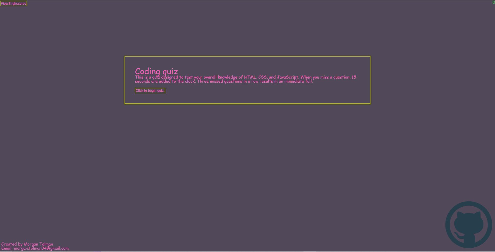

# Timed-Coding-Quiz

## Description

For this project I was tasked with creating a quiz with no starter code.  This means that all the code is my own, excluding the reset.css.  I coded the majority of my html elements in JavaScript to test my abilities.  I decided to create and link different JavaScript and HTML files as well.  Initially this was a challenge, but with persistance I was able to create a fully functioning quiz that is live on the web.  This quiz can be used to help junior developers to study.  Over the course of this project I learned many things in both JavaScript, CSS, and HTML as well.

## License

MIT license

## Links

[Live Website](https://unheardof77.github.io/Timed-Coding-Quiz/)
[Github](https://github.com/unheardof77)

